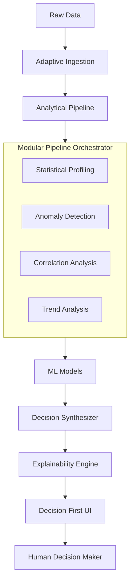

# 🧠 Autonomous Decision Intelligence System (ADIS)

<div align="center">
  
  
  
  
  
  
</div>

<p align="center">
  <strong>Transforming raw data into high-confidence, explainable decisions.</strong>
  <br />
  ADIS is a production-grade Decision Intelligence platform that bridges the gap between descriptive analytics and actionable business strategy.
</p>

---

## 🎯 Core Objective

In an era of data overload, ADIS solves the **"Decision Gap"**. While typical dashboards tell you *what* happened, ADIS tells you **why** it happened and **what action** to take next. It utilizes a rigorous multi-signal analytical pipeline to provide traceable, justified, and high-confidence recommendations with zero manual configuration.

## 🚀 Key Features

- **🛡️ Adaptive Ingestion:** Intelligent parsing of CSV/JSON with automatic schema inference and 20+ point quality profiling.
- **🔬 Multi-Signal Pipeline:** Advanced analytical layer performing statistical distribution checks, anomaly detection (Z-Score, IQR, MAD), and cross-variable correlation.
- **🤖 Autonomous ML:** Seamlessly integrated forecasting and clustering models with automated hyperparameter selection.
- **⚖️ Reasoning Engine:** A weighted synthesis layer that resolves conflicting signals and reflects uncertainty in decision confidence.
- **📖 Layered Explainability:** Dual-track justifications providing high-level executive summaries and deep-dive technical reasoning chains.
- **📊 Decision-First UI:** A premium React dashboard focused on "Actions over Information," featuring confidence gauges and factor breakdowns.
- **💬 Decision Chat:** Natural language interaction grounded in the latest analysis results.

---

## 🏗 System Architecture

ADIS is built on a decoupled, micro-modular architecture designed for scalability and reliability.



---

## 🛠 Tech Stack

| Layer | Technology |
|---|---|
| **Frontend** | React 18, TailwindCSS, Recharts, Lucide, Framer Motion |
| **Backend** | Python 3.11+, FastAPI, Pydantic, Scikit-learn, Pandas |
| **Persistence** | MongoDB (Audit Trail & Performance Metrics) |
| **Infrastructure** | Docker, Docker Compose, Kubernetes, Prometheus |

---

## ⚙️ Installation and Setup

### Prerequisites
- Python 3.10+
- Node.js 18+
- MongoDB (Optional for full audit trail support)

### 1. Clone & Prepare
```bash
git clone https://github.com/santanu949/Autonomous-Decision-Intelligence-System-ADIS-.git
cd Autonomous-Decision-Intelligence-System-ADIS-
```

### 2. Backend Orchestrator
```bash
cd backend
python -m venv venv
source venv/bin/activate  # Windows: venv\Scripts\activate
pip install -r requirements.txt
cp .env.example .env
python server.py
```

### 3. Frontend Dashboard
```bash
cd ../frontend
npm install
npm start
```

---

## 📖 Under The Hood: The Pipeline

ADIS doesn't just "guess." It follows a rigorous 8-stage processing cycle:

1. **Validation:** Checks for data drift, completeness, and consistency.
2. **Statistics:** Generates distribution profiles and detects skewness.
3. **Anomalies:** Runs three concurrent detection methods and uses a voting mechanism to flag outliers.
4. **Correlations:** Identifies lead-lag relationships and significant dependencies.
5. **Trends:** Analyzes temporal signals for growth velocity and stability.
6. **ML Inference:** Executes time-series forecasting and multi-dimensional clustering.
7. **Synthesis:** Weighs all previous outputs using a business-centric heuristic engine.
8. **Explainability:** Generates a dual-track response: a **What** (Decision) and a **Why** (Reasoning).

---

## 🔮 Roadmap & Future Vision

- [ ] **Real-time Streaming:** Integration with Apache Kafka for sub-second decisioning.
- [ ] **Advanced Simulations:** Monte Carlo path analysis for probabilistic outcomes.
- [ ] **Multi-Agent Collaboration:** Dedicated agents for specific domains (Finance, Logistics, Marketing).
- [ ] **Self-Correction:** Feedback loop that learns from the outcome of implemented decisions.

## 📱 Visual Identity

The ADIS interface utilizes a **High-Contrast Professional Aesthetic**:
- **Palette:** Slate (#0f172a), Indigo (#4f46e5), and Cyan (#06b6d4).
- **UX Strategy:** "Progressive Disclosure"—show the decision first, then allow the user to drill down into the math.
- **Feedback:** Vibrant confidence gauges and color-coded risk indicators provide instant visual context.

---

<div align="center">
  <sub>Built with ❤️ by the ADIS Team. © 2026. All rights reserved.</sub>
</div>
